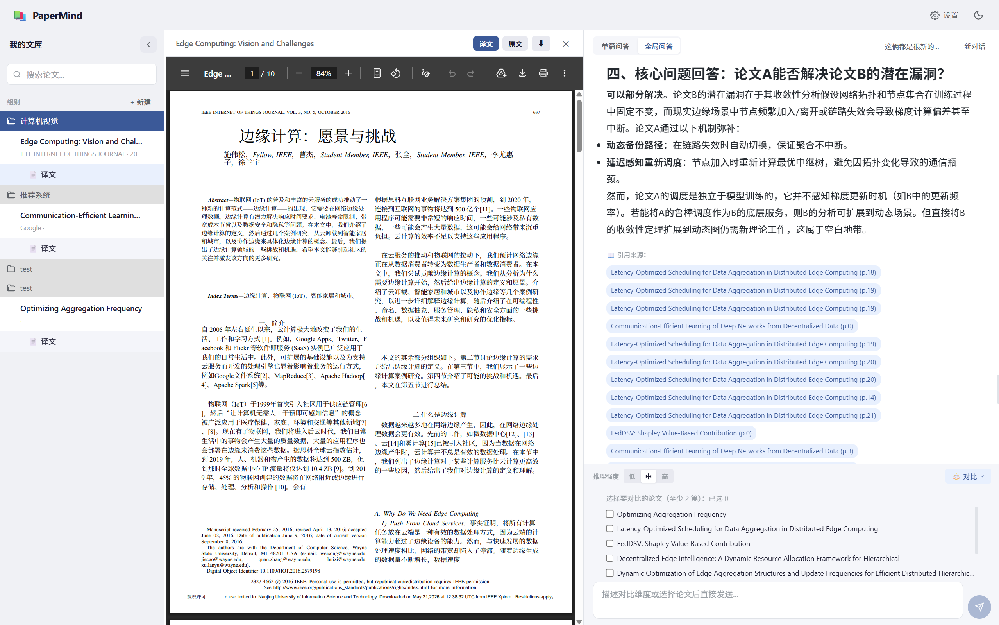
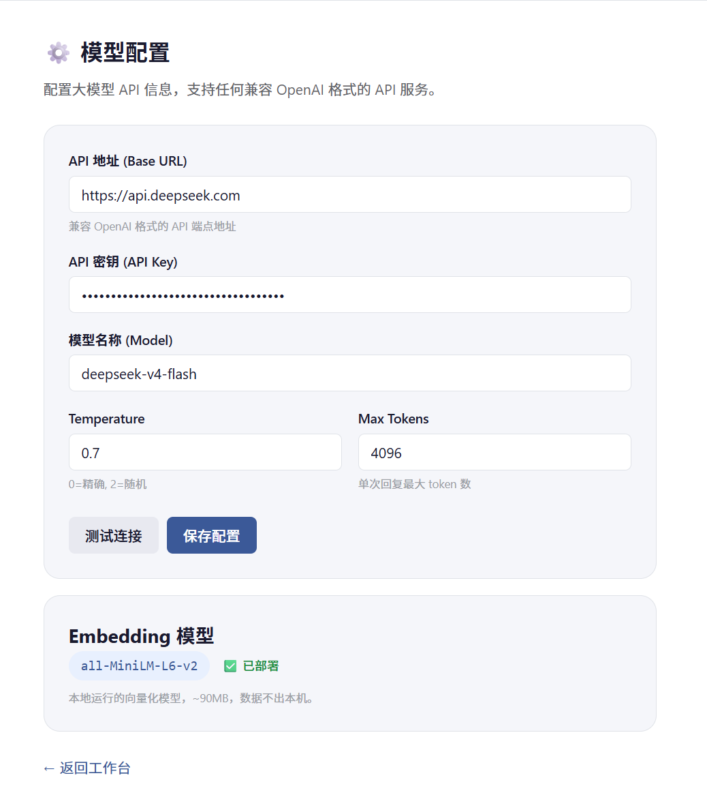

<div align="center">

# 📚 PaperMind

**论文阅读 AI Agent——你的智能论文助手**

[](https://vuejs.org/)
[](https://fastapi.tiangolo.com/)
[](https://python.langchain.com/)
[](https://python.org/)
[](LICENSE)



</div>

---

## ✨ 功能特性

| 功能 | 说明 |
|------|------|
| **📄 PDF 原文展示** | 浏览器内嵌 PDF 阅读器，保留论文原始排版、图表、公式 |
| **🤖 RAG 智能问答** | 基于论文内容的向量检索 + 大模型生成，回答附带引用来源 |
| **📝 预设分析功能** | 一键生成结构化学术摘要、算法深度分析、参考文献整理 |
| **⚖️ 论文对比** | 多篇论文多维度对比分析（研究问题/方法/数据/结果/创新/局限） |
| **🗂 组别管理** | 创建组别（文件夹）组织论文，支持搜索和筛选 |
| **🌐 PDF 翻译** | 支持大模型翻译、Google 翻译、Bing 翻译三种服务，保留排版 |
| **💬 多会话对话** | 每篇论文独立对话历史，支持多会话切换和持久化 |
| **🌙 暗色模式** | 简约黑白色调暗色主题，舒适阅读 |
| **🔌 模型自由** | 兼容任何 OpenAI 格式的 API 服务（DeepSeek、GPT、Claude 等） |
| **🔒 完全本地** | 嵌入模型本地运行，论文数据不出本机 |

---

## 🖼 界面预览

### 主工作台（论文阅读 + 对话）


### 模型配置



---

## 🏗 技术架构

```
┌─────────────────────────────────────────────────────────┐
│                      Frontend (Vue 3)                    │
│  PaperLibrary │ PaperViewer │ ChatPanel │ Settings     │
└──────────────────────┬──────────────────────────────────┘
                       │ HTTP / SSE
┌──────────────────────▼──────────────────────────────────┐
│                     Backend (FastAPI)                    │
│  ┌──────────┐ ┌──────────┐ ┌────────────┐ ┌─────────┐  │
│  │ Papers    │ │ Chat     │ │ Translation│ │ Settings │  │
│  │ API       │ │ API(SSE) │ │ API        │ │ API      │  │
│  └─────┬─────┘ └────┬─────┘ └──────┬──────┘ └────┬────┘  │
│        │            │              │              │       │
│  ┌─────▼────────────▼──────────────▼──────────────▼─────┐ │
│  │              Services Layer (LangChain)               │ │
│  │  ParserService │ VectorService │ ChatService        │ │
│  │  ChunkingService │ CompareService                   │ │
│  └─────┬──────────────────────────┬────────────────────┘ │
│        │                          │                       │
│  ┌─────▼──────┐      ┌───────────▼───────────┐          │
│  │  SQLite    │      │     ChromaDB          │          │
│  │  (业务数据) │      │  (向量索引)            │          │
│  └────────────┘      └───────────────────────┘          │
│                                                          │
│  ┌──────────────────────────────────────────────────┐   │
│  │            PDF 解析管线 (本地)                    │   │
│  │  PyMuPDF → pdfplumber → Chunking → Embedding   │   │
│  └──────────────────────────────────────────────────┘   │
└──────────────────────────────────────────────────────────┘
```

### 技术栈明细

| 组件 | 技术 |
|------|------|
| 前端框架 | Vue 3 + Vite + Vue Router + Pinia |
| 后端框架 | Python 3.12 + FastAPI |
| AI 框架 | LangChain（RAG 管线） |
| 大模型 | 用户自选 API（OpenAI 兼容格式） |
| Embedding 模型 | all-MiniLM-L6-v2（本地，~90MB） |
| 向量数据库 | ChromaDB |
| 业务数据库 | SQLite (aiosqlite) |
| PDF 解析 | PyMuPDF（主力）+ pdfplumber（表格） |
| 文档切分 | 基于章节标题的语义切分（tiktoken） |
| PDF 翻译 | pdf2zh / Google Translate / Bing Translate |

---

## 🚀 快速开始

### 前置条件

- Python 3.11+
- Node.js 18+
- npm 9+

### 1. 克隆项目

```bash
git clone https://github.com/yourusername/PaperMind.git
cd PaperMind
```

### 2. 启动后端

```bash
cd backend
python -m venv venv
venv\Scripts\activate        # Windows Git Bash
# source venv/Scripts/activate  # Git Bash
pip install -r requirements.txt
uvicorn app.main:app --reload --port 8000
```

### 3. 启动前端

```bash
cd frontend
npm install
npm run dev
```

### 4. 打开浏览器

访问 [http://localhost:3000](http://localhost:3000)

### 一键启动

```bash
# Windows 双击 start.bat 即可同时启动前后端
start.bat
```

---

## ⚙ 配置说明

### 大模型 API

首次使用需在设置页配置大模型 API（支持任何 OpenAI 兼容接口）：

| 字段 | 说明 |
|------|------|
| API 地址 | 如 `https://api.deepseek.com/v1` |
| API 密钥 | 你的 API Key |
| 模型名称 | 如 `deepseek-chat`、`gpt-4o` |
| Temperature | 0-2，控制随机性 |
| Max Tokens | 单次最大生成长度 |

### 本地 Embedding 模型

向量检索依赖 `all-MiniLM-L6-v2` 模型（~90MB），设置页可一键部署。
模型自动下载到本地 HuggingFace 缓存，离线运行。

### PDF 翻译

支持三种翻译引擎：
- **大模型翻译** — 使用已配置的 LLM API，更准确
- **Google 翻译** — 免费，需科学上网
- **Bing 翻译** — 免费，需科学上网

---

## 📂 项目结构

```
PaperMind/
├── frontend/               # Vue 3 前端
│   └── src/
│       ├── components/      # 通用组件
│       ├── views/           # 页面组件
│       ├── stores/          # Pinia 状态管理
│       ├── api/             # API 调用
│       └── router/          # 路由配置
├── backend/                 # FastAPI 后端
│   └── app/
│       ├── api/routes/      # API 路由
│       ├── services/        # 业务逻辑
│       ├── parsers/         # PDF 解析
│       ├── db/              # 数据库
│       ├── core/            # 核心配置
│       └── models/          # Pydantic 模型
├── docs/                    # 文档
├── imgs/                    # 截图
└── start.bat                # 一键启动脚本
```

---

## 🧪 核心功能详解

### RAG 问答流程

```
用户提问
  → Embedding → ChromaDB 相似度检索（top-k chunks）
  → 历史对话检索（messages collection）
  → LangChain Prompt 模板（预设 System Prompt + 上下文拼接）
  → LLM 流式生成（SSE）
  → 返回回答 + 引用来源 + 会话持久化
```

### 文档切分策略

基于论文本身的章节标题进行语义切分，而非固定 token 数硬切：

| 参数 | 默认值 | 说明 |
|------|--------|------|
| 单 chunk 上限 | 1500 tokens | 超长节按段落二次切分 |
| 短节合并阈值 | 200 tokens | 相邻短节合并 |
| 重叠量 | 200 tokens | 二次切分时保留上下文 |
| 编码器 | cl100k_base | tiktoken |

### 两轮对比检索

```
第一轮 — 全局检索（top-10）
  → 快速定位最相关的论文和片段
第二轮 — 针对性补充（每篇 top-5）
  → 确保每篇论文有充分信息覆盖
合并去重 → 构建 Prompt → LLM 生成对比分析
```

---


## 🙏 致谢

- [pdf2zh](https://github.com/Byaidu/PDFMathTranslate)
